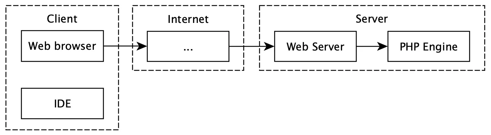
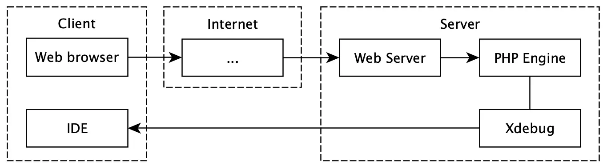
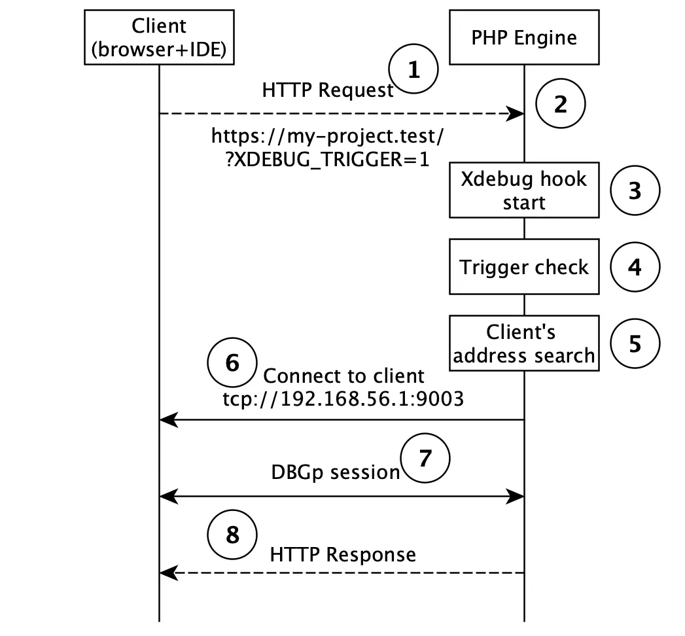
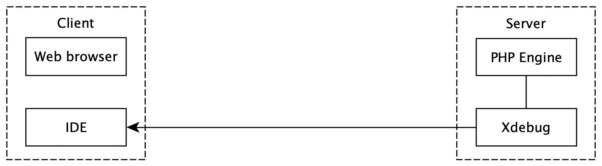
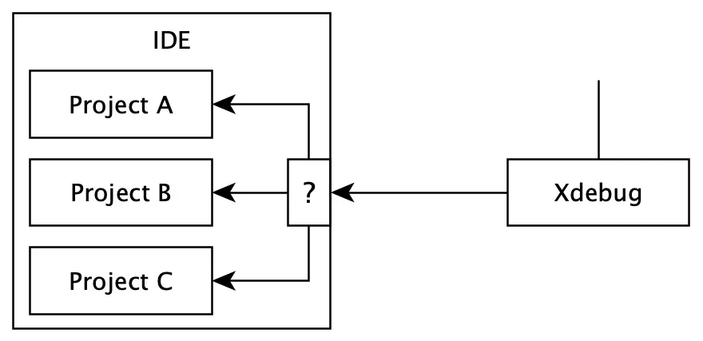
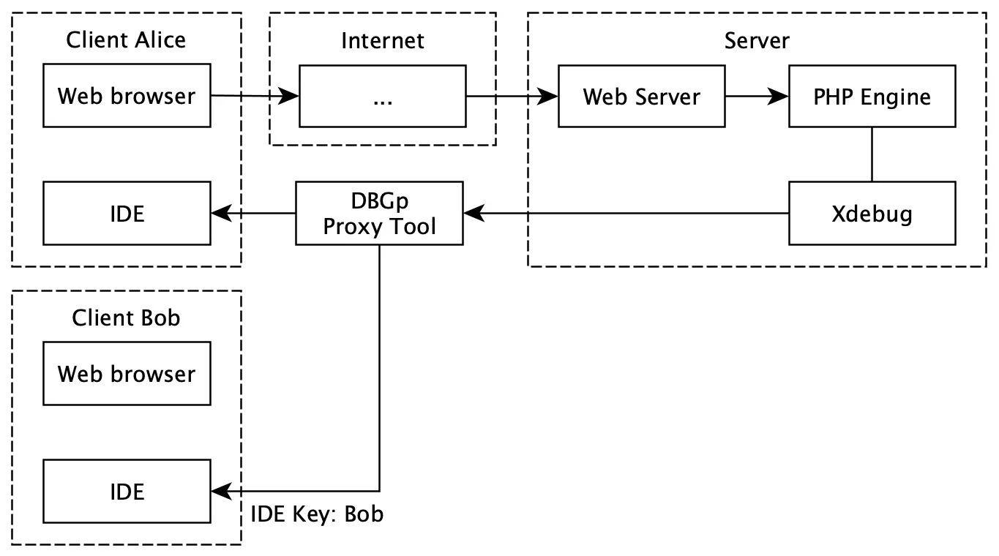
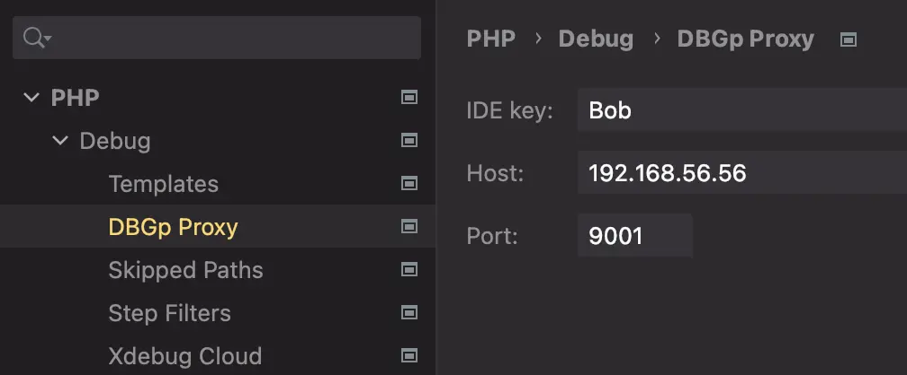
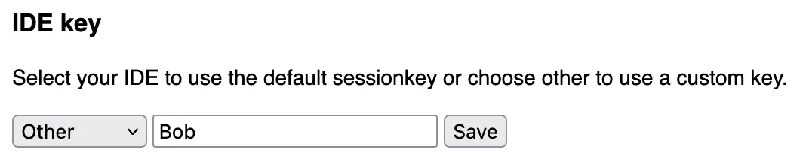
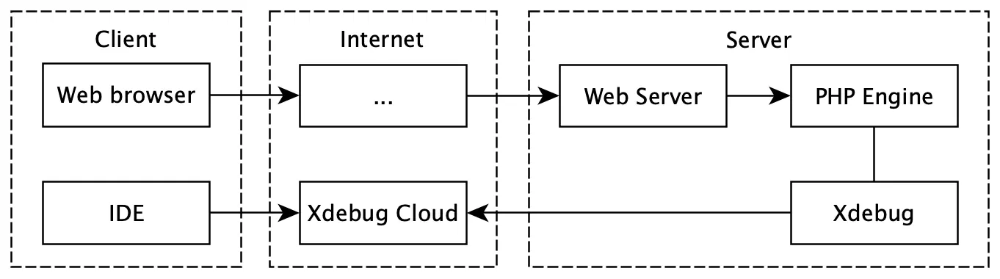
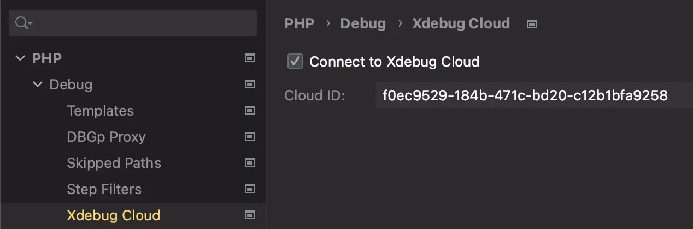

---
hide:
  - navigation
comments: true
---

# Why cannot you set up Xdebug?

## Abstract

Most users experience hardships with setting up [Xdebug](https://xdebug.org/){:target="_blank"} in their development environments. This problem has deteriorated for two reasons:

- Insufficient understanding of Xdebug work
- An overload of ambiguous and inaccurate google-answers

As long as the second reason is hard to affect, this article focuses on reducing the impact of the first reason. So the goal is to explain how Xdebug works under the hood, how an IDE interacts with Xdebug, and how a web browser side has to function. The narrative format of the article will help systematize your knowledge in an orderly manner. As a result, the acquired knowledge will lead to reduction of efforts on setting Xdebug up in an unfamiliar environment.

In addition, you will gain insights into the following related questions: What is DBGp Proxy Tool, and why you should not use Xdebug Cloud. You won't gain any information about installing the Xdebug extension or using the debugger.

## Problem area

Setting up Xdebug requires an interaction with several components in the development environment — a client, a server, an IDE. The number of components and their potential working environment lead to complications in a configuration process. Understanding how Xdebug works will reduce efforts on setting up Xdebug in any development environment.

!!! note ""

    Configuration examples are presented only for Xdebug version 3.

## Operational principle

Let's start with PHP. In some perspective PHP applications could work in two modes:

- The Web mode — handling incoming HTTP requests from a browser

    Examples of stacks working with the mode: php cgi, nginx+fpm, nginx unit

- The CLI mode — direct execution from a terminal

    Examples of stacks working with the mode: roadrunner, phpunit, horizon

Xdebug works the same in these two modes. But we are going to examine them separately for clarification.

### The Web mode

It is assumed that a web server has already started and ready to handle HTTP requests. An illustration of HTTP request path from a client to PHP looks like the one below:



!!! note ""

    `...` — means the presence of intermediate nodes that take place in the Internet. They may not exist in a local development.

Xdebug injects to that flow (note that the extension tries to connect back to the client):



Let's examine this process step-by-step in more detail:



!!! note ""

    In that context, the client is a local host. It has a running browser that sends an HTTP request and an IDE that listens to incoming connections from Xdebug.

1. The client sends the HTTP request with a trigger which means that this request must be debugged.
2. The PHP script is started, then it receives and handles the request.
3. The PHP engine during startup hooks runs the Xdebug extension.
4. Checking the presence of the trigger is in progress.
5. A client's address is being searched.
6. Attempts are being made to establish a connection with the client.
7. Debugging launch: transfering control to the client, communication, waiting commands from the client.
8. The end of debugging due to a stop command from the client or a finish of script execution.

#### The trigger

The HTTP request must contain a special trigger to initialize the Xdebug session on the server side. The trigger is a simple key+value pair: `XDEBUG_TRIGGER=<any value>` (the legacy version is still working `XDEBUG_SESSION=<any value>`). This trigger must be a part of the HTTP request from one of the possible options:

- Cookie
- Query param
- Post payload

A popular browser extension [Xdebug Helper](https://chrome.google.com/webstore/detail/xdebug-helper/eadndfjplgieldjbigjakmdgkmoaaaoc?hl=en){:target="_blank"} uses the Cookie approach to transfer that trigger.

!!! note ""

    The `xdebug.trigger_value` setting allows to configure the exact value for activation the debugging process. By default, Xdebug accepts any non-empty value.

#### The Xdebug hook and the trigger checking

The Xdebug extension integrates with the PHP lifecycle. So when the PHP engine starts, the Xdebug startup hook checks the presence of the trigger. If there is no trigger, the Xdebug extension doesn't attempt establishing a connection and PHP continues to work as usual.

#### The search for a client's address and establishing a connection

If there was a positive check, the Xdebug extension starts to search for the client's address and establish a connection with it. The success of this step is the established connection with a client's IDE.

The search logic is simple. Just iterate (by trying to connect) all potential clients' addresses until the first succeed connection has been found. Here is an example of the workflow:

1. Xdebug tries to connect to the address from the environment variable `HTTP_X_FORWARDED_FOR`
2. Xdebug tries to connect to the address from the environment variable `REMOTE_ADDR`
3. _(fallback)_ Xdebug tries to connect to the address from the Xdebug configuration (by default, it is `localhost`)

If all attempts have failed, PHP would go on as usual (without debugging).

!!! warning ""

    By default, checking addresses from environment variables is disabled, and Xdebug only looks at the fallback address. Enabling this option frees you of hard coding the client's address.

The described workflow uses this configuration:

```ini
; This is overridden behavior. By default, it is disabled
xdebug.discover_client_host = true

; This is used as the fallback address
xdebug.client_host = localhost
; Xdebug always connects to an IDE on this port
xdebug.client_port = 9003
```

#### The communication with the client

[DBGp](https://xdebug.org/docs/dbgp){:target="_blank"} protocol aims to form communication between the Xdebug extension and the IDE. As a result, the familiar features like breakpoints, stacktrace, variable inspection are worked in the IDE.

At that step, the interactive debugging process has started for the client.

### CLI mode

CLI applications are run from a console. An illustration of injecting Xdebug in the CLI mode looks like the one below:



The communication is similar to the [Web mode](#web-mode) but with a few distinctions:

1. The trigger `XDEBUG_TRIGGER` must be passed as an environment variable to initialize the Xdebug session.

2. Checking addresses from environment variables feature (from the [Searching client's address](#searching-clients-address-and-establishing-a-connection) section) won't work in that mode. The `xdebug.client_host` setting has to be overridden with the client's address.

```ini
xdebug.client_host = <client's address>
xdebug.client_port = 9003
```

Here is an example of starting PHP in the CLI mode with the enabled Xdebug extension:

```shell
XDEBUG_TRIGGER=1 php script.php
```

### IDE

The main task of the IDE is to accept the Xdebug connection and provide an interactive debug process for users. But also the IDE has to deal with two nontrivial issues — a file mapping and working with multiple projects.

#### File mapping

What is a file mapping issue? The absolute path to the file containing code is used in actions such as the 'Step over' command or when a user sets breakpoints. These paths will differ between the IDE and the Xdebug extension if the code is being executed in an isolated environment, like a virtual machine, a container or a remote server.

The Xdebug extension can only work with its paths and cannot control the file mapping itself. Instead, the IDE performs the correct file mapping between the local and remote paths.

Here's an example of how the IDE substitutes these paths to maintain proper communication with the Xdebug extension (based on user settings):

[//]: # (TODO: maybe be more specific?)

|                  |                                      |
|------------------|--------------------------------------|
| Local host path  | `/Users/macos/my-project/index.php`  |
| Remote host path | `/home/vagrant/my-project/index.php` |

#### Multiple projects



Nowadays, developers often work on multiple projects at the same time. How to achieve automatic routing of incoming Xdebug requests to the right project?

This problem is fully solved in PhpStorm and partially in Visual Studio Code. In the next section, the description will be provided.

#### PhpStorm integration

PhpStorm's logic uses fuzzy criteria to determine the correct routing. In general, it consists of two steps:

1. Getting values from environment variables that has been set at start of the PHP script. PhpStorm iterates through them until the first non-empty has found:

    - `PHP_IDE_CONFIG`
    - `SERVER_NAME` and `SERVER_PORT`
    - `SSH_CONNECTION`

    The found value is used as an identifier of the project.

    !!! warning ""

        If all environment variables have empty values, an interactive debug process in not possible.

2. Searching for the right project from in the project settings `Settings` / `PHP` / `Servers`. If there is no match, PhpStorm adds a new `Server` based on the calculated identifier.

As a result, created `Server` will be used for automatic routing and correct file mapping.

#### Visual Studio Code integration

The popular [PHP Debug Adapter](https://github.com/xdebug/vscode-php-debug){:target="_blank"} for Visual Studio Code brings all usual debugging processes and file mapping via `pathMappings` setting in the configuration`launch.json`, except for working with multiple projects.

The current solution assumes that only one project at a time can listen to Xdebug connections. For that reason, a user has to manually change a project that will be debugged.

## Proxy

!!! note ""

    This section is dedicated to the solutions (that collaborate with Xdebug) that can enhance a development environment. The content will be accompanied by examples of usage the solutions with PhpStorm.

The proxy allows the establishment of the connection from the debugger to the IDE through an intermediate node. That approach makes it possible to:

- Easily configure the Xdebug extension
- Bypass network restrictions
- Debug an application by multiple users

### DBGp Proxy Tool

[DBGp Proxy Tool](https://xdebug.org/docs/dbgpProxy){:target="_blank"} is a utility that runs on a node. It provides two features: partially coping with [NAT](https://en.wikipedia.org/wiki/Network_address_translation){:target="_blank"} and allowing multiple users to debug an application simultaneously (on a shared stage, for example).




Setting up is divided into two parts: configuration on the server side and configuration on the client side. Here is the server side configuration:

1. Xdebug establishes a connection with DBGp Proxy Tool. So the Xdebug configuration must have the explicit address of DBGp Proxy Tool specified in the `xdebug.client_host` setting.

    ```ini
    ; Disable auto discover from environment variables
    xdebug.discover_client_host = false
    xdebug.client_host = <address of DBGp Proxy Tool>
    xdebug.client_port = 9003
    ```

2. DBGp Proxy Tool starts on the node and listens to new connections from the Xdebug extension and the IDE.

    ```shell
    ./dbgpProxy --server 0.0.0.0:9003 --client 0.0.0.0:9001
    ```

Here is the client side configuration:

1. The client's IDE sends a request to DBGp Proxy Tool. This request contains an IDE key — a unique identifier for DBGp Proxy Tool that used for routing the Xdebug session to the right client.

    

2. A user prepares the IDE key on the browser side and initiates debugging of an HTTP request. The trigger with the specific value must be set — `XDEBUG_TRIGGER=Bob`.

    

    Under the hood `XDEBUG_TRIGGER=Bob` will be sent as Cookie.

When the setup is completed, DBGp Proxy Tool will route the Xdebug session to the client's IDE using the specified IDE key from the client's HTTP request.

!!! warning ""

    DBGp Proxy Tool establishes new connections to the IDE for each new incoming Xdebug request. This implies that the connection from DBGp Proxy Tool to the client must not be affected by network restrictions.

### Xdebug Cloud

[Xdebug Cloud](https://xdebug.cloud/){:target="_blank"} is a commercial product. It simplifies significantly the installing process. Moreover, it affords to establish the Xdebug session between nodes behind NAT and firewalls. Multi-user usage is also supported.



The setting up workflow is small:

1. Get the Cloud ID (register + pay)

2. Put the Cloud ID into the Xdebug configuration:

    ```ini
    xdebug.cloud_id = f0ec9529-184b-471c-bd20-c12b1bfa9258
    ; The timeout should be higher for the reliable connection
    xdebug.connect_timeout_ms = 1000
    ```

3. Put the Cloud ID into the configuration of PhpStorm.

    

That's it. This is the easiest way to set up Xdebug in any environment! But...

!!! danger "Be aware!"

    The connection between the PHP engine and Xdebug Cloud is not secured. The DBGp protocol allows to execute any PHP code. So, in case of [man-in-the-middle attack](https://en.wikipedia.org/wiki/Man-in-the-middle_attack){:target="_blank"}, an attacker can gain a full access to your system ([issue link](https://github.com/xdebug/xdebug/pull/646){:target="_blank"}).

    For that reason use Xdebug Cloud at your own risk!

## Troubleshooting

This troubleshooting is focused on covering basic steps that can help in most cases. Comprehending the information posted above is highly necessary for following the troubleshooting.

### How to diagnose a problem?

If Xdebug does not connect to an IDE, follow this checklist to diagnose a problem:

1. Check that the Xdebug extension is installed for both CLI and Web modes:

    ```shell
    php -v
    ->    with Xdebug v3.3.1, Copyright (c) 2002-2023, by Derick Rethans

    php-fpm -v
    ->    with Xdebug v3.3.1, Copyright (c) 2002-2023, by Derick Rethans
    ```

2. Check the actual configuration of Xdebug. The CLI and Web modes use their own configurations. This means that changes must be made twice, once for the CLI mode and once for the Web mode:

    ```shell
    php -i | grep xdebug

    php-fpm -i | grep xdebug
    ```

    1. Pay attention on these options:

        ```ini
        xdebug.mode = debug                   ; For Step Debugging mode, always use 'debug'
        xdebug.start_with_request = default   ; For Step Debugging mode, always use 'default'
        xdebug.client_port = 9003             ; Use this port as the default
        xdebug.discover_client_host =         ; Depending on your environment, it could be 'true' or 'false'
        xdebug.client_host =                  ; If the previous setting is 'false', then type the client's address here
        xdebug.idekey =                       ; Leave the empty value if you don't use DBGp Proxy Tool
        ```

    2. The changes must be made in `.ini` files. Use these commands to detect their locations:

        ```shell
        php --ini

        php-fpm -i  # Check the beginning of the output
        ```

        !!! note ""

            Keep in mind to restart PHP-FPM after the changes have been made.

3. Check if the client's address is correct:

    1. In a Docker environment on Mac or Windows, the only solution is:

        ```ini
        xdebug.discover_client_host = false
        xdebug.client_host = host.docker.internal
        ```

    2. In a Docker environment on Linux or a virtual machine in any operational system (with host only network), the auto discover feature works fine:

        ```ini
        xdebug.discover_client_host = true
        xdebug.client_host = localhost
        ```

    3. On localhost or on a remote server with an open SSH connection to it:

        ```ini
        xdebug.discover_client_host = false
        xdebug.client_host = localhost
        ```

4. Inspect a log file of the Xdebug extension:

    ```ini
    xdebug.log = /tmp/xdebug.log
    xdebug.log_level = 7
    ```

5. Inspect a log file of PhpStorm:

    - Open: **Help** / **Diagnostic Tools** / **Debug Log Settings**
    - Add line and save: `#com.jetbrains.php`
    - Checkout the log file: **Help** / **Show Log in Finder/Explorer/Navigator**

### How to set up PhpStorm?

PhpStorm offers a variety of features for working with PHP, including debugging. However, there is a set of settings that have to be configured to achieve the full experience.

1. Ensure that one of the environment variables (from the [PhpStorm integration](#phpstorm-integration) section) is set on the server side.
    1. If `SERVER_NAME` or `SSH_CONNECTION` are not set (as is often the case in a Docker environment), using `PHP_IDE_CONFIG` becomes the only appropriate solution.
    2. The `PHP_IDE_CONFIG` variable must adhere to the following pattern: `serverName=<SomeName>`.

2. Add your PHP interpreter in following section: `Settings` / `PHP` / `CLI interpreter`.
3. Additionally, add file mapping in the same section.
4. The `Server` record must be provided in the `Settings` / `PHP` / `Server` section. PhpStorm creates it for you after the first attempt of the Xdebug session.
5. Additionally, add file mapping for the created `Server`.

As a result, you can run CLI scripts with debugging, execute tests with execute, always listen for PHP Debug connections and expect debugging in the correct project.

### Debugging an SPA-application

Mostly, backend and frontend applications are located at different addresses. In that case, the browser extension [Xdebug Helper](https://chrome.google.com/webstore/detail/xdebug-helper/eadndfjplgieldjbigjakmdgkmoaaaoc){:target="_blank"} doesn't send the debugging trigger to the backend. The main solution is to use the same domain for both applications.

1. Edit the configuration file of the frontend application's web-server. If [webpack](https://webpack.js.org/){:target="_blank"} is used, then modify `webpack.config.js`:

    ```javascript
    module.exports = {
      devServer: {
        // Use the same configuration block for `vite.config.js`
        proxy: {
          '/api': {
            target: `${process.env.BACKEND_URL}`,
            changeOrigin: true,
            xfwd: false,
          },
        },
      ...
    ```

2. Update the backend address to match the frontend application address on the client (typically by modifying the `BACKEND_URL` variable in the `.env.local`)

Now, all request with the `/api` prefix will be proxied to the backend. the `XDEBUG_TRIGGER` trigger will be sent as a Cookie.

### Debugging in other environments

Check out [Ultimate Guide](https://www.jetbrains.com/help/phpstorm/debugging-with-phpstorm-ultimate-guide.html){:target="_blank"} from JetBrains. There are a few cases of debugging in nonstandard environments (like via SSH tunnel). Also, you can find more solutions to real problems there.

Check out [Step Debugging](https://xdebug.org/docs/step_debug){:target="_blank"} on the official Xdebug website.
