# How does Xdebug work?

<!-- toc -->

- [Problem area](#problem-area)
- [Operational principle](#operational-principle)
  * [Web mode](#web-mode)
    + [Trigger](#trigger)
    + [Xdebug hook and Trigger check](#xdebug-hook-and-trigger-check)
    + [Searching client's address and establishing a connection](#searching-clients-address-and-establishing-a-connection)
    + [Communication with the client](#communication-with-the-client)
    + [End of debugging](#end-of-debugging)
  * [CLI mode](#cli-mode)
  * [IDE](#ide)
    + [File mapping](#file-mapping)
    + [Project search](#project-search)
    + [PhpStorm integration](#phpstorm-integration)
    + [Visual Studio Code integration](#visual-studio-code-integration)
- [Proxy](#proxy)
  * [DBGp Proxy](#dbgp-proxy)
  * [Xdebug Cloud](#xdebug-cloud)
- [Troubleshooting](#troubleshooting)
  * [How to inspect a problem?](#how-to-inspect-a-problem)
  * [Debugging a long-running application](#debugging-a-long-running-application)
  * [Debugging an SPA-application](#debugging-an-spa-application)

<!-- tocstop -->

## Problem area

Setting up Xdebug requires interaction with several components in the development environment — client, server, IDE. The number of components and their potential working environment lead to complications in configuration process. Understanding how Xdebug works will reduce efforts on setting Xdebug up in any development environment.

## Operational principle

To begin with, let's start with PHP. In some perspective PHP applications could work in two modes:

- Web mode — handling incoming HTTP requests from the browser

  Examples of stacks working with: nginx+fpm, nginx unit

- CLI mode — direct execution from the terminal

  Examples of stacks working with: roadrunner, phpunit, horizon

Xdebug works the same in these two modes. But for easy understanding we are going to examine them separately.

### Web mode

It is assumed that web server has already started and ready to handle HTTP requests. The illustration of HTTP request path from a client to PHP looks like the one below:

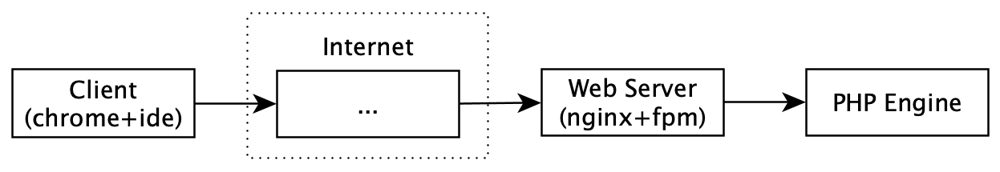

> ℹ️ `...` — means the presence number of intermediate nodes that take place in the public network. They may not exist in the local development.

Xdebug injects to that flow (note that the extension tries to connect back to the client):

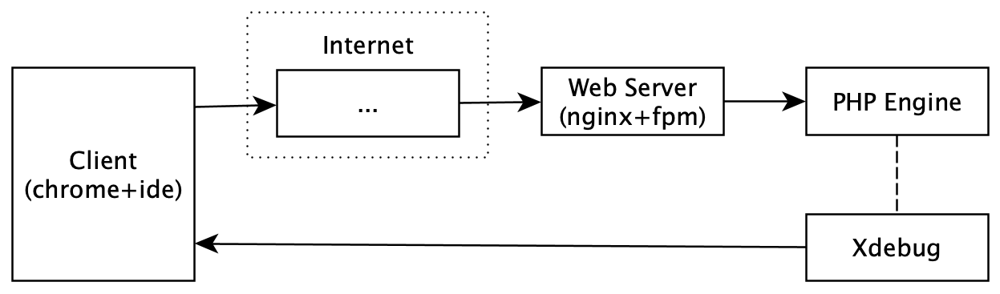

Let's examine this process step-by-step in more detail:

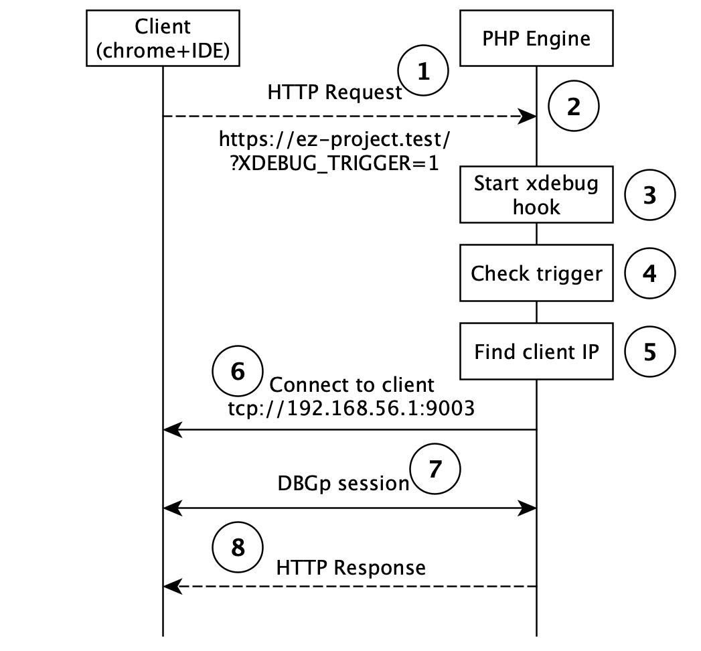

> ℹ️ In that context, the client is local host. It has a running browser that sends HTTP request and the IDE that listens for incoming connections from Xdebug.

1. The client sends an HTTP request with a trigger which means that this request must be debugged.
2. Starting PHP script that receives and handles the request.
3. The PHP engine in startup hooks runs Xdebug extension.
4. Checking the presence of the trigger.
5. Searching client's address.
6. Attempts to establish connection with the client.
7. Start of debugging: control transfer to the client, communication, waiting commands from the client.
8. End of debugging due to stop command from the client or ending of script execution.

#### Trigger

The HTTP request must contain special trigger to initialize Xdebug session on the server side. The trigger is simple key+value pair: `XDEBUG_TRIGGER=<any value>` (legacy version is still working `XDEBUG_SESSION=<any value>`). This trigger must be part of the HTTP request from one of the possible options:

- Cookie
- Query param
- Post payload

The popular browser extension [Xdebug Helper](https://chrome.google.com/webstore/detail/xdebug-helper/eadndfjplgieldjbigjakmdgkmoaaaoc?hl=en) uses the Cookie approach to transfer the trigger.

> ℹ️ `xdebug.trigger_value` setting allows for configuration a value that serves as the exact trigger for Xdebug extension. By default, trigger value could be anything.

#### Xdebug hook and Trigger check

The Xdebug extension integrates with the PHP lifecycle. So when PHP engine starts, startup hook of Xdebug checks the presence of the trigger. If there is no trigger, Xdebug extension doesn't attempt establishing a connection and PHP continues to work as usual.

#### Searching client's address and establishing a connection

If there was a positive check, Xdebug extension starts searching the client's address and establishes a connection with it.

> ℹ️ In that context, the client is still the one who sent HTTP request

The established connection with the client is a condition for the success of this step.

The algorithm is based on checking potential clients' addresses until all are checked. Check consists of getting address from runtime-variable and bounding connection with it. In case of success, established connection is used. In case of failure, proceed to the next address. In case of consideration of all possible addresses, the last attempt with the reserved (from configuration) address performs.

Here is an example of how Xdebug extension works with the applied configuration below:

1. Establish a connection to the address from HTTP header `X-FORWARDED-FOR`
2. Establish a connection to the address from environment `REMOTE_ADDR` (mostly used)
3. _(reserved)_ Establish a connection to the address from Xdebug configuration (by default, it is `localhost`)

If all attempts have failed, then PHP will continue to work as usual.

> ⚠️ By default, checking addresses from runtime-variables is disabled, and Xdebug only looks at reserved address. The enabled setting could be used instead of hardcoding the client's address or in an environment with multiple developers.

The using configuration:

```ini
; This is overridden behavior. By default, it is disabled
xdebug.discover_client_host = true

; This is used as reserved address
xdebug.client_host = localhost
; Xdebug always connects to the IDE on this port
xdebug.client_port = 9003
```

> ℹ️ `xdebug.client_discovery_header` setting allows override of runtime-variables which will be checked as potential clients' addresses.

#### Communication with the client

The communication between Xdebug extension and an IDE occurs utilizing [DBGp](https://xdebug.org/docs/dbgp) protocol. This protocol aims to form communication between these units. As a result, the IDE is provided with familiar features like breakpoints, stacktrace, viewing variables in the debugging process.

#### End of debugging

The connection between the IDE with Xdebug extension breaks. PHP script completes the work.

The next HTTP request that has to be debugged will go through this whole cycle.

### CLI mode

CLI application is run by the user. The illustration of injecting Xdebug to CLI call looks like one below:

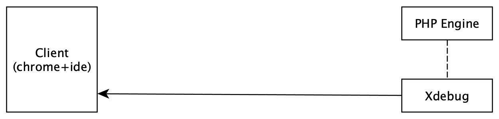

The communication is similar to the [Web mode](#web-mode) but with a few distinctions:

1. Special trigger `XDEBUG_TRIGGER` must be passed as environment variable to initialize Xdebug session.

2. Checking addresses from runtime-variables feature from [Searching client's address](#searching-clients-address-and-establishing-a-connection) section won't work in that mode. The easiest way to solve this problem is by using a reserved address from `xdebug.client_host` setting. The setting could be overridden at PHP startup time.

Here is an example of running PHP in CLI with enabled Xdebug extension:

```shell
XDEBUG_TRIGGER=1 php -d xdebug.client_host=<host address> script.php
```

### IDE

Apart from performing the main role of accepting connection from Xdebug and providing interactive debugging process, IDE also has to deal with two nontrivial issues — file mapping and searching the right project.

#### File mapping

As was mentioned before, Xdebug uses DBGp protocol that works in command-response manner — an IDE sends command (such as 'Step over') through that protocol and receives response with a new debugging state.

Let's take it closer to the response of the 'Step over' command that steps to the next line of code. Pointer moves to line 42 in an IDE:

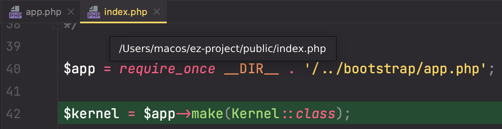

Under the hood an IDE receives raw response from Xdebug:

```xml
<?xml version="1.0" encoding="iso-8859-1"?>
<response xmlns="urn:debugger_protocol_v1" xmlns:xdebug="https://xdebug.org/dbgp/xdebug" command="step_over" transaction_id="17" status="break" reason="ok">
    <xdebug:message filename="file:///home/vagrant/ez-project/public/index.php" lineno="42"></xdebug:message>
</response>
```

Look at the filenames. These filename paths are different from each other. The reason is that code runs in an isolated environment such as virtual machine or container. At the same time, an IDE controls code on the host side. So one of the IDE goals is to provide mapping between the local host path and the remote host path of the project for the proper functioning with Xdebug extension. For the above example, IDE must have configured mapping something like this:

|                  |                            |
|------------------|----------------------------|
| Local host path  | `/Users/macos/ez-project`  |
| Remote host path | `/home/vagrant/ez-project` |

#### Project search

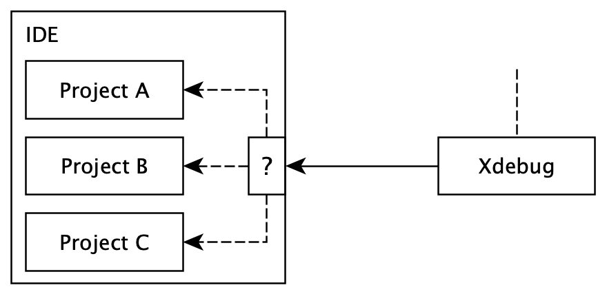

Nowadays, a developer could work on multiple projects at the same time. As a consequence, several projects are open on the local machine. All of these opened projects wait for the connection from Xdebug. So the responsibility of an IDE is to correspond incoming Xdebug request with the right project.

This problem is fully solved in PhpStorm and partially in Visual Studio Code. In the next section, the description will be provided.

#### PhpStorm integration

The integrated debugger of PhpStorm provides all default features. Phpstorm also solves the noticed issues above but in a slightly special way. Let's dive deeper.

PhpStorm listens incoming connections from various remote servers. And when the IDE accepts a new connection, it has to route this connection to the right PhpStorm's project. Routing depends on the declared servers in all projects' settings:

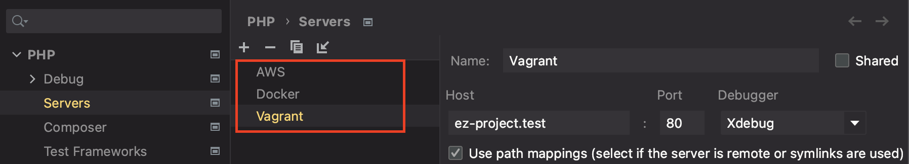

So PhpStorm uses the next algorithm to find the right project:

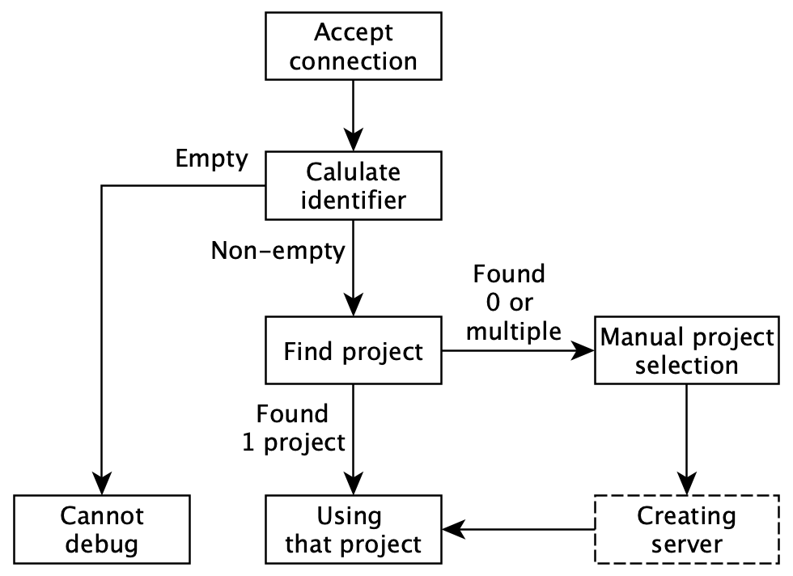

1. Accepting a new connection.
2. Calculating the identifier of the server (just a simple request to execute PHP code via DBGp Protocol). PhpStorm asks to execute expressions one by one until it gets the first non-empty result:

   - Executing `$_SERVER['PHP_IDE_CONFIG']`

     The result could be: `serverName=laradock`

   - Executing `$_SERVER['SERVER_NAME']` and `$_SERVER['SERVER_PORT']`

     The result could be: `ez-project.test` and `443`

   - Executing `$_SERVER['SSH_CONNECTION']`

     The result could be: `10.0.2.2 53500 10.0.2.15 22` (the last IP address and port number are used)

   2.1. If all execution results have returned empty values, then the IDE can't identify the connection and asks the user to use `PHP_IDE_CONFIG` environment.

      

3. Searching the project's Server that is capable to handle the incoming connection. The search depends on how the identifier has been found:

   - If `$_SERVER['PHP_IDE_CONFIG']` result has been set, then IDE performs a search for Server by its `Name`:

     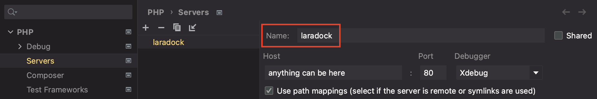

   - If `$_SERVER['SERVER_NAME']`/`$_SERVER['SERVER_PORT']` result or `$_SERVER['SSH_CONNECTION']` result have been set, then performs search for Server by its `Host` and `Port`

     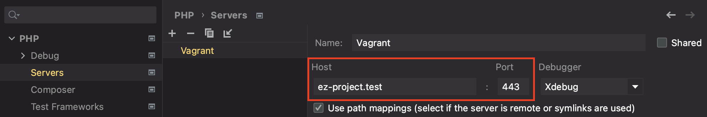

   3.1. If 0 or more than 1 project have been found, then PhpStorm will offer to manually choose the right project.

     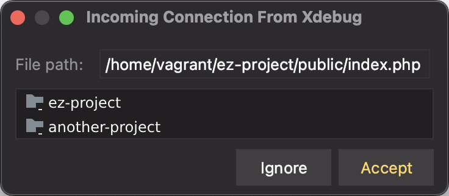

   3.2. PhpStorm will create Server if identifier has been found using other than `PHP_IDE_CONFIG` variable.

4. The found (or selected) project is used for interactive debugging.

The last step is to configure file mapping. As the Server has been created, there is a place where path mapping has to be specified:

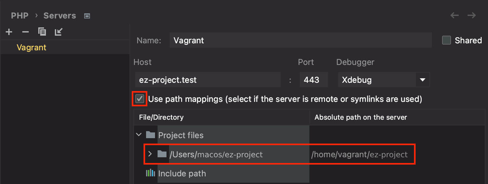

It also should set CLI interpreter up in PhpStorm and the same mapping to run and debug CLI scripts (like PHPUnit tests) from the IDE.

> ℹ️ There are minor edge cases that are not described. But the information I've given is enough to understand the basics. Use it when setting up for an unfamiliar environment.

#### Visual Studio Code integration

The popular [PHP Debug Adapter](https://github.com/xdebug/vscode-php-debug) for Visual Studio Code brings all usual debugging process and file mapping via `pathMappings` setting in `launch.json`, except of working with multiple projects.

The current solution assumes that only one project can listen for PHP Debug connections. For that reason, user has to manually change project that will be debugged.

## Proxy

> ℹ️ This section is dedicated to the related solutions that work in cooperation with Xdebug and could be profitable in a development environment. The content will be accompanied by examples of using with PhpStorm.

Proxy allows to establish connection from debugger to IDE through intermediate node. That approach makes it available to:

- Configure Xdebug easily
- Debug an application with multiple users
- Bypass network restrictions

### DBGp Proxy

[DBGp Proxy](https://xdebug.org/docs/dbgpProxy) is utility that runs on a node. It provides two features: partially cope with NAT and allow multiple users to debug an application simultaneously (on shared stage, for example).

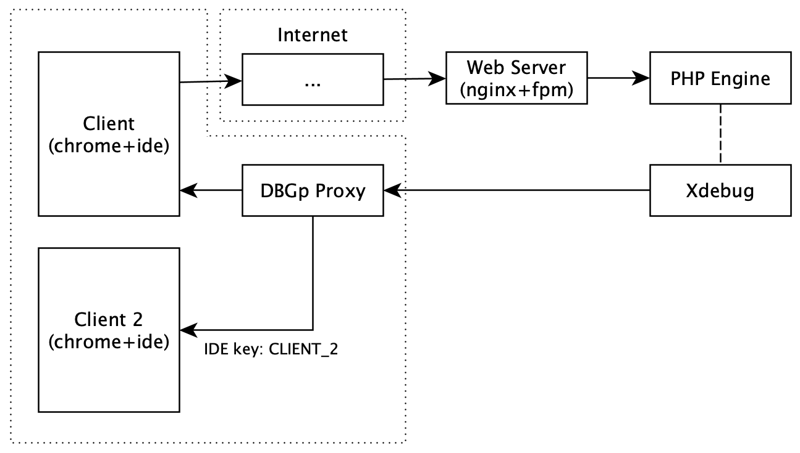

Setting up is split to 2 parts: configuration on server's side and configuration on client's side. Here is server's side configuration:

1. Xdebug establishes a connection with DBGp Proxy. So PHP configuration must have the explicit address of DBGp Proxy tool in `xdebug.client_host` option.

    ```ini
    ; Disable auto discover
    xdebug.discover_client_host = false
    xdebug.client_host = <address of DBGp Proxy>
    xdebug.client_port = 9003
    ```

2. DBGp Proxy tool starts on the node and listens new connections from Xdebug and IDE.

   ```shell
   ./dbgpProxy --server 0.0.0.0:9003 --client 0.0.0.0:9001
    ```

For the client's side:

1. Client's IDE sends request to DBGp Proxy tool. This request contains IDE key — unique identifier for DBGp Proxy tool that uses for routing Xdebug session to the right client.

   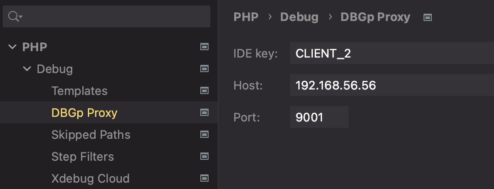

2. User prepares IDE key on the browser side and initiates debugging HTTP request. Trigger with the specific value must be set — `XDEBUG_TRIGGER=CLIENT_2`.

   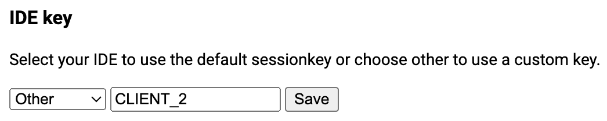

   Under the hood `XDEBUG_TRIGGER=CLIENT_2` will be sent as Cookie.

When setup is complete DBGp Proxy will route debug session to the client's IDE by specified IDE key from client's HTTP request.

> ⚠️ DBGp Proxy tool establishes new connections to IDE for incoming Xdebug requests. It means that the connection between DBGp Proxy and clients must not be affected by network restrictions.

### Xdebug Cloud

[Xdebug Cloud](https://xdebug.cloud/) is commercial product. It significantly simplifies installing process. Moreover, it affords to establish Xdebug session between nodes behind NAT and firewalls. Multi-user usage is also supported.

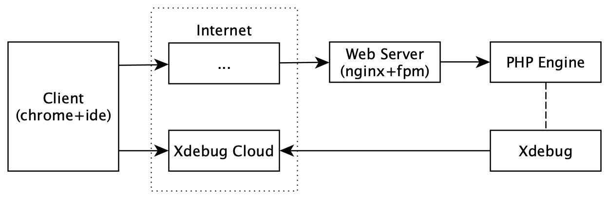

Setting up workflow is small:

1. Get the Cloud ID (register + pay)

2. Put Cloud ID in configuration of PHP:

    ```ini
    xdebug.cloud_id = f0ec9529-184b-471c-bd20-c12b1bfa9258
    ; Timeout should be higher for the reliable connection
    xdebug.connect_timeout_ms = 1000
    ```

3. Put Cloud ID in configuration of PhpStorm.

   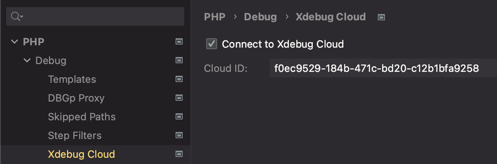

That's all. It is the easiest way to set up Xdebug in any environment.

> ⚠️ Be aware! Connection between PHP engine and Xdebug Cloud is not secured. DBGp protocol allows to execute any PHP code. So, in man-in-the-middle attack, attacker could gain full access to your system ([issue link](https://github.com/xdebug/xdebug/pull/646)).
>
> For that reason use Xdebug Cloud at your own risk!

## Troubleshooting

There are a lot of guides about setting Xdebug up in the Internet. This section is purposed for setting in a nonstandard environments.

### How to inspect a problem?

If Xdebug does not connect to an IDE, follow this checklist to inspect a problem.

1. Check that Xdebug extension is installed for FPM and CLI modes:

    ```shell
    php -v
    ->    with Xdebug v3.2.1, Copyright (c) 2002-2023, by Derick Rethans

    php-fpm -v
    ->    with Xdebug v3.2.1, Copyright (c) 2002-2023, by Derick Rethans
    ```

2. Check the actual configuration of Xdebug:

    ```shell
    php -i | grep xdebug

    php-fpm -i | grep xdebug
    ```

3. Inspect log file of Xdebug extension:

   - Enable logging in `xdebug.ini`:

      ```ini
      xdebug.log = /var/log/xdebug.log
      ```

   - Set the correct permissions to the log file:

     ```shell
     touch /var/log/xdebug.log
     chmod 666 /var/log/xdebug.log
     ```

4. Inspect log file of PhpStorm:

   - Open: **Help** / **Diagnostic Tools** / **Debug Log Settings**
   - Add line and save: `#com.jetbrains.php`
   - Checkout the log file: **Help** / **Show Log in Finder/Explorer/Navigator**

### Debugging a long-running application

A long-running application could produce workers that has to be debugged. For that case:

1. Add this line near with the inspected code:

   ```php
   xdebug_connect_to_client();
   ```

2. Run a long-running application with disabled option:

   ```shell
   php -d xdebug.start_with_request=no artisan horizon
   ```

### Debugging an SPA-application

Mostly backend and frontend applications are located at different addresses. In that case, browser extension [Xdebug Helper](https://chrome.google.com/webstore/detail/xdebug-helper/eadndfjplgieldjbigjakmdgkmoaaaoc) doesn't send the debugging trigger to the backend. The main solution is to use the same domain for both applications.

1. Edit configuration file of frontend application web-server. If [webpack](https://webpack.js.org/) is used, then edit `webpack.config.js`:

    ```javascript
    module.exports = {
      devServer: {
        // Use the same configuration block for the `vite.config.js`
        proxy: {
          '/api': {
            target: `${process.env.BACKEND_URL}`,
            changeOrigin: true,
            xfwd: false,
          },
        },
      ...
    ```

2. Change backend address to the frontend application address in the client (usually, it is something like changing `BACKEND_URL` variable in `.env.local`)

Now all request with `/api` prefix will be proxied to the backend. `XDEBUG_TRIGGER` trigger will be sent as Cookie.

**Alternative solution:**

1. Find the request for the debugging in the DevTool Network tab.
2. Copy like `copy as cURL`.
3. Paste it in the terminal and add to the end `-H 'Cookie: XDEBUG_TRIGGER=1`.
4. Send the request.
